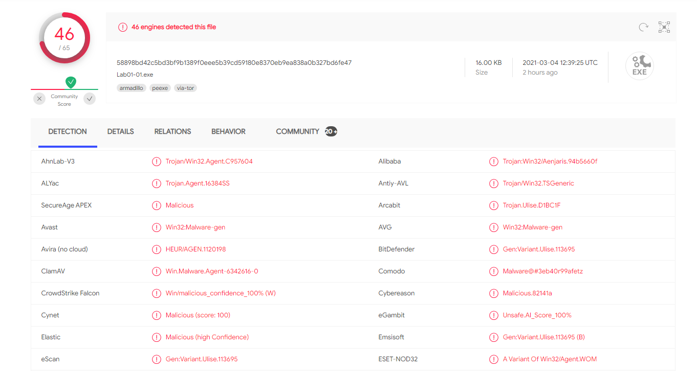
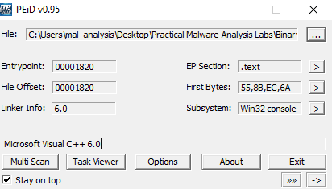
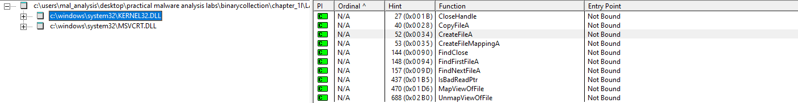
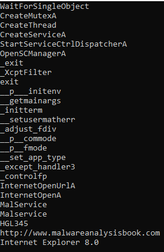
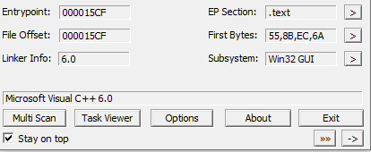
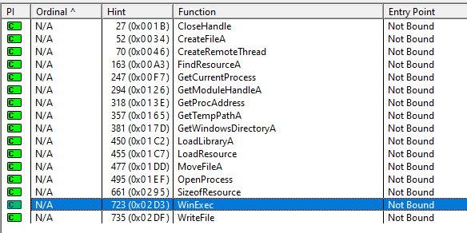

This post is a part of the series of [Practical Malware Analysis](https://nostarch.com/malware) lab writeups.

# Lab 1-1

This lab uses the files Lab01-01.exe and Lab01-01.dll.

**Question 1:** Upload the files to http://www.VirusTotal.com/ and view the reports. Does either file match any existing antivirus signatures?

* * *

When uploading Lab01-01.dll to virustotal we can see that `42` out `69` AV engines detected this file.

For the Lab01-01 EXE file `46` out of `65` engines detected the file.

* * *

**Question 2:** When were these files compiled?

* * *

We can use `PEview` to find the compilation date.
When we first open the file using the tool we see the file's raw data.

To find the compilation time we need click on the plus (+) symbol that is next to `IMAGE_NT_HEADERS`. After that we need to click on `IMAGE_FILE_HEADERS`. The `Time Date Stamp` description will give us our compilation time.

When we go through this process on the EXE file we can see that the compilation date was `Sunday 12-19-2010 at 16:16:19 UTC`.

For the DLL file the compilation date was `Sunday 12-19-2010 at 16:16:38 UTC`.

* * *

**Question 3:** Are there any indications that either of these files is packed or obfuscated? If so, what are these indicators?

* * *

Using the `strings` from Sysinternals we are able to see a good amount of strings for both files (EXE is on the left the DLL is on the right.

We can investigate further by using a tool called `PEiD`. This tool can help us identify if the two files were packed.

`PEiD` tells us that neither the DLL file nor the EXE file are packed. (1st image is the DLL 2nd is the EXE)

* * *

**Question 4:** Do any imports hint at what this malware does? If so, which imports
are they?

* * *

To the view the imports of the files we can use `Dependency Walker`.

When we run the tool with the EXE file we can see that the `Kernel32.DLL` is imported. Upon closer inspection it looks like there are a few functions that are used for creating and finding files.

When we look at the DLL file we see that it imports the `Kernel32.DLL` and the `WS2_32.DLL`. From the `Kernel32.DLL` the DLL file uses the `CreateProcess` function. This means that we need to be on the lookout for new processes being spanwed.

As stated earlier the Lab01-01 DLL also uses the `WS2_32.DLL`. The `WS2_32.DLL` is often used for networking functions and if the you want your program to connect to another network.

When we first take a look at the functions we are only given the ordinal number. This means that we need to match up the ordinal numbers with all the functions that can be imported. When we do this we see that the DLL file uses functions such as `closesocket` and `connect`.

* * *

**Question 5 & 6:** Are there any other files or host-based indicators that you could look for on the infected systems? What network-based indicators could be used to find this malware on infected machines?

* * *

When we take a closer look at the output from the `strings` command we ran earlier we can actually find a few host and network based indicators.

The EXE file contains strings that say `kerne132.dll` where the `L` for kernel is replaced by a one. It also contains a path to this DLL `C:\Windows\System32\Kernel32.dll`. We can use this as an indicator and look for the DLL file after the malware has been ran.

From a network-based indicator perspective the Lab01-1 DLL file contains an IP address of `127.26.152.13` that can be found in the strings output. We can be on the lookout for connections that coming from and go to this address.

* * *

**Question 7:** What would you guess is the purpose of these files?

* * *

Based on the information we gathered I think that the malware's purpose is to act as a remote shell. It reminds me of something that is similar to an exe file that connects a target back to a C2 server.

# Lab 1-2

**Question 1:** Upload the Lab01-02.exe file to http://www.VirusTotal.com/. Does it match any existing antivirus definitions?

* * *

When uploading the file to virustotal we can see that `55` out `71` AV engines detected this file.

* * *

**Question 2:** Are there any indications that this file is packed or obfuscated? If so, what are these indicators? If the file is packed, unpack it if possible.

* * *

`PEiD` tells us that this file was packed with `UPX v1.25(Delphi) Stub`.

We can unpack the file with `UPX`.

* * *

**Question 3:** Do any imports hint at this program’s functionality? If so, which imports are they and what do they tell you?

* * *
This EXE imports a few DLLs. The DLLs to pay attention to are Kernel32, Advapi32, and Wininet.

### Kernel32 
Looks like it is used to create a thread and search for some module files.

### Advapi32 
This DLL is being used to create a service, start the service and to open the service control manager.

### Wininet
 This used to run some internet related operations and to open a URL. We may see some http or https traffic coming from this EXE.
 

* * *
**Question 4:** What host- or network-based indicators could be used to identify this malware on infected machines?
* * *
When we run `strings` we see a URL `http://www.malwareanalysisbook.com`. This can be treated as a network-based indicator. We can look for any connections going to and from the URL.

# Lab 1-3

**Question 1:** Upload the Lab01-03.exe file to http://www.VirusTotal.com/. Does it match any existing antivirus definitions?

* * *
When uploading the file to virustotal we can see that `51` out `70` AV engines detected this file.

* * *

**Question 2:** Are there any indications that this file is packed or obfuscated? If so, what are these indicators? If the file is packed, unpack it if possible.

* * *
`PEiD` says that this file has been packed with `FSG 1.0`.

Right now we don't know how to unpack this file (based on the book) so we'll revist the unpacking part later.

* * *

**Question 3:** Do any imports hint at this program’s functionality? If so, which imports are they and what do they tell you?

* * *

We can't see much since the file is packed but we do know that it is importing the `Kernel32.dll` and is using the `LoadLibrary` and `GetProcAddress` functions.

* * *

**Question 4:** What host- or network-based indicators could be used to identify this malware on infected machines?
* * *
Besides the DLL information that we already knew about we don't get any useful indicators when we run the `strings`. This due to the fact that the file is still packed.

# Lab 1-4

**Question 1:** Upload the Lab01-04.exe file to http://www.VirusTotal.com/. Does it match any existing antivirus definitions?

* * *

When uploading the file to virustotal we can see that `52` out `66` AV engines detected this file.

* * *

**Question 2:** Are there any indications that this file is packed or obfuscated? If so, what are these indicators? If the file is packed, unpack it if possible.

* * *
`PEiD` shows that the file is not packed.

* * *

**Question 3:** When was this program compiled?

* * *

The program was compiled `Friday 8-30-2019 at 22:26:59 UTC`

**Question 4:** Do any imports hint at this program’s functionality? If so, which imports are they and what do they tell you?

* * *

There are two imports that are worth noting: `Kernel32` and `Advapi`.

### Kernel32 

This DLL is used to create a file, write a file, execute a file, load libraries, as well as other potentially malicious things.

### Advapi

The DLL uses functions that look up privileges and opens process tokens.

* * *

**Question 5:** What host- or network-based indicators could be used to identify this malware on infected machines?

* * *

We can use the url `http://www.practicalmalwareanalysis.com/updater.exe` as a network indicator. We can also see that there is a file path `\system32\wupdmgrd.exe` and an EXE file `\winup.exe` that we can use as host based indicators.

* * *

**Question 6:** This file has one resource in the resource section. Use Resource Hacker to examine that resource, and then use it to extract the resource. What can you learn from the resource?

* * *

Using `Resource Hacker` we can see that there is a bin file in the EXE.

We can save the file as a binary file and use `Dependency Walker` to view the imports.

When we look at the imports we see that there is a `URLMON.DLL`. This DLL allows the program to download a URL's contents to a file.

