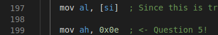

# CSAW 2018 - A Tour of x86

This challenge tries to help beginners learn some assembly language by answering some questions as they read through the code. 

You can find the files on [OSIRIS Lab's](https://github.com/osirislab/CSAW-CTF-2018-Quals/tree/master/rev/A-Walk-Through-x86-Part-1) GitHub page.

**Question 1:** What is the value of `dh` after `line 129` executes? (Answer with a one-byte hex value, prefixed with '0x')
`xor dh, dh  ; <- Question 1`
* * *

Anything `xored` by itself equals `0x00`.

* * *
**Question 2:** What is the value of `gs` after `line 145` executes? (Answer with a one-byte hex value, prefixed with '0x')
`mov gs, dx ; to use them to help me clear     <- Question 2`
* * *

At `line 131` all of the values for `dx` becomes 1's in binary so when we `not` `dx` in the next line `dx` becomes `0`. This means that we are moving `0x00` into `gs`. This is why we are able to  the jump to `.death` on `line 135`.

* * *
**Question 3:** What is the value of `si` after `line 151` executes? (Answer with a two-byte hex value, prefixed with '0x')
`mov si, sp ; Source Index       <- Question 3`
* * *

On `line 107` 0 was moved into the `cx` register. 

On `line 149` the stack pointer is set to `cx`. This means that the source index becomes `0x0000` on line 151.

* * *
**Question 4** What is the value of `ax` after `line 169` executes? (Answer with a two-byte hex value, prefixed with '0x')
`mov al, 't'`
`mov ah, 0x0e      ; <- question 4`
* * *

The letter `t` is moved into the `al` register. `t` in hex is `0x74`. `0x0e` is moved into the `ah` register. Since `ah` contains the 8 higher bits of the `ax` register and `al` holds the lower 8 bits, `ax` looks like this `0x0e74`. 

* * *
**Question 5** What is the value of `ax` after `line 199` executes for the first time? (Answer with a two-byte hex value, prefixed with '0x')
`mov ah, 0x0e  ; <- Question 5!`
* * *

In the `.init` we move `ax`, which contains our string, into `si`. 

Then in the `.print_char_loop` there is a check for if the dereferenced value of `si` is equal to zero. If `si` equals zero we jump to `.end`.

Right now the print loop just started so `[si]` should be equal to `a` which is the first character in our string. Since `si` does not equal zero we can continue with our loop. 

`si` is then moved into `al` (the lower 8 bits of ax). 

When `0x0e` is moved in `ah`, `ax` then becomes `0x0e61`. The `61` is there because that is `a` in hex.

When we input our answers into the server we get our flag. The flag is `flag{rev_up_y0ur_3ng1nes_reeeeeeeeeeeeecruit5!}`

