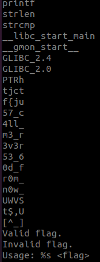
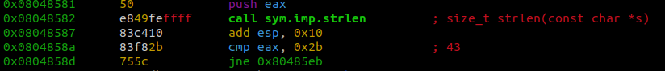

# TJCTF 2018 - Validator

This challenge is from an old TJCTF competition. The file they gave us displays the message `Valid flag` if it recieves the correct flag.

* * *

The `file` command tells us that this is a 32 bit elf file.

When we run `strings` we can see something that looks like the flag 

 

To confirm that this is actually the correct flag let's disassemble the file.

When we disassemble the `main` function in `radare2` we are able to see values being moved into different `vars`. These values look like the characters we saw from the `strings` command earlier.

To confirm that this is infact the correct flag we can enter a dummy string and compare our input with `var_38h`. We need to make sure that our string is 43 characters so that we can pass the string length comparison at `0x0804858a`. 

To generate the string quickly we can use this oneliner `''.join(random.choices(string.ascii_uppercase + string.digits, k=43))` 

We will also need to set a breakpoint at `0x080485ba`. This is where `eax` is being pushed to the string compare after receiving the address of the flag string. 

When we hit our breakpoint, `eax` contains the address `0xffda8060`.

When we view the contents stored at the address we get the flag.

When we enter in the flag as a solution we get `Valid flag`.

