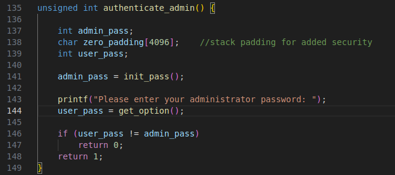
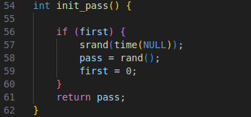
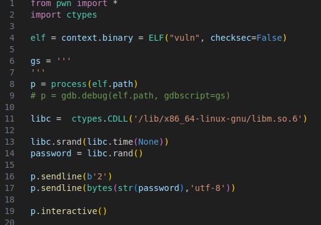
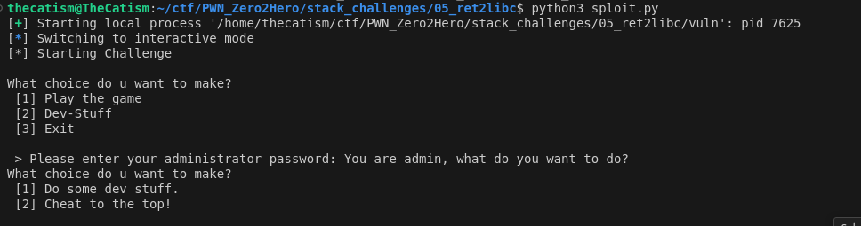
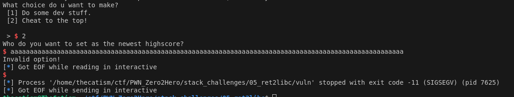
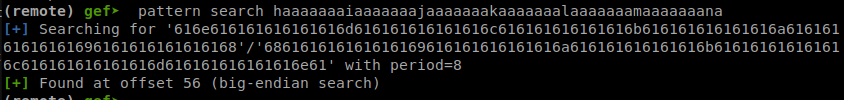
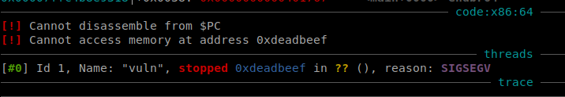
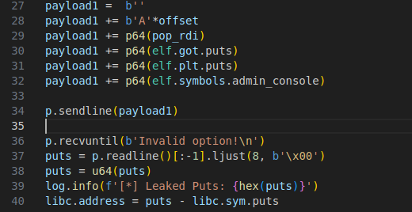
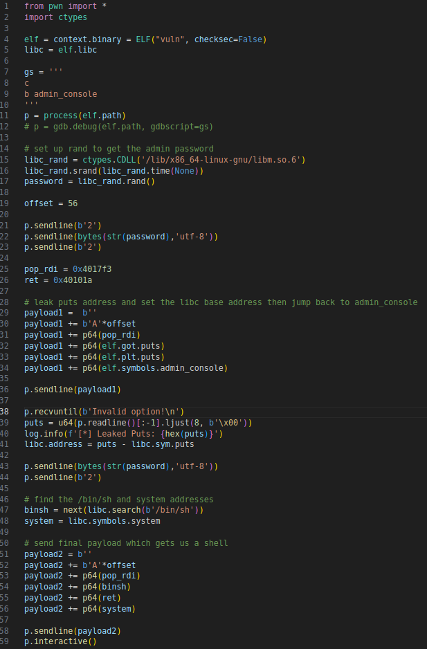
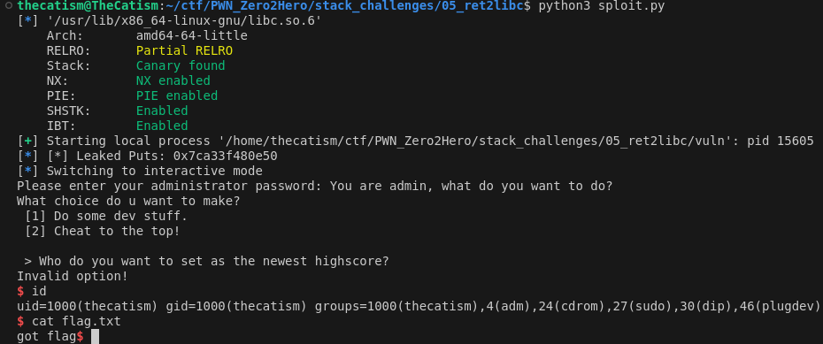

Challege #5 from Seal's Pwn Zero2Hero.

* * *

The source for the challenge is below.

```
#include <stdio.h>
#include <stdlib.h>
#include <string.h>
#include <time.h>
#include <stdint.h>

//gcc vuln.c -fno-stack-protector -no-pie -o vuln

__attribute__((constructor)) void ignore_me(){
    setbuf(stdin, NULL);
    setbuf(stdout, NULL);
    setbuf(stderr, NULL);
}

int first = 1;
int pass;

typedef struct game 
{
    unsigned long long score;
    unsigned long long rng[100];
} game;

void print_menu() {
	puts("What choice do u want to make?");
	puts(" [1] Play the game");
    puts(" [2] Dev-Stuff");
    puts(" [3] Exit");
    printf("\n > ");	
}

void print_gamestart() {
	puts("What choice do u want to make?");
	puts(" [1] Play the game");
    puts(" [2] Dont play the game");
    printf("\n > ");
}

void print_game_menu() {
	puts("What choice do u want to make?");
	puts(" [1] Play the game");
    puts(" [2] Give up and print answers");
    puts(" [3] Restart Game");
    printf("\n > ");
}

void print_admin_console() {
	puts("What choice do u want to make?");
	puts(" [1] Do some dev stuff.");
    puts(" [2] Cheat to the top!");
    printf("\n > ");
}

int init_pass() {
    
    if (first) {
        srand(time(NULL));
        pass = rand();
        first = 0;
    }
    return pass;
}

int get_option() {
	char buf[0x20];

	if (fgets(buf, sizeof(buf), stdin) == NULL) {
            exit(-1);
    }  
    return atoi(buf);
}

void play_game() {
	uint32_t choice;
    unsigned long long * player_guess = (unsigned long long *)malloc(16 * 8);
    game cur_game;

	print_gamestart();

    choice = get_option();

    switch(choice) 
    {
        case 1:
            cur_game.score = 0;

            for (int i=0; i < 100; i++)
                cur_game.rng[i] = rand();
            break;

        case 2:
            return;
    }

    print_game_menu();
    choice = get_option();

    switch(choice) 
    {
        case 1:
            for(int i=0; i < 10; i++) 
            {
                player_guess[i] = get_option();

                if (player_guess[i] == cur_game.rng[(i + rand()) % 100]) 
                {
                    printf("Good job, you got a point!\n");
                    cur_game.score++;
                }
            }

            if (cur_game.score == 8) 
            {
                printf("Nice! You win!\n");
                return;
            }
            
            break;

        case 2:
            for (int i=0; i < 100; i++)
                printf("%d. %llx\n", i, cur_game.rng[i]);
            return;
        
        case 3:
            play_game();
            break;
        
        default:
            printf("Invalid option!\n");
            break;
    }
}

unsigned int authenticate_admin() {

    int admin_pass; 
    char zero_padding[4096];    //stack padding for added security
    int user_pass;

    admin_pass = init_pass();

    printf("Please enter your administrator password: ");
    user_pass = get_option();

    if (user_pass != admin_pass)
        return 0;
    return 1;
}

void admin_console() {
	char name[0x28];
	uint32_t choice;

	if (!authenticate_admin()) {
		puts("You aren't admin!\n");
		return;
	}

	puts("You are admin, what do you want to do?");

	print_admin_console();

	choice = get_option();

	switch(choice) {
		case(1):
			puts("You chose not to cheat. Good job! Also kinda boring though.");
			break;

		case(2):
			puts("Who do you want to set as the newest highscore?");
			fgets(name,0x120,stdin);

		default:
			printf("Invalid option!\n");
            break;
	}
}

void menu() {
	uint32_t choice;

	while(1) {
		print_menu();
		
	    choice = get_option();

	    switch(choice) {
	    	case(1):
	    		play_game();
	    		break;
	    	case(2):
	    		admin_console();
	    		break;
	    	case(3):
	    		return;
	    }	
	}
}

void main() {
    
    puts("[*] Starting Challenge\n");
    menu();
}

```

Gist is you have a game that also has a switch case for an admin console.

## Vulnerability 

The first vulnerabilty is a `bad seed` vuln. The admin password that gets created was set using a rand call that was seeded using srand(time(NULL)). We can replicate the password easily using ctypes in python.





The second vulnerabilty is a buffer overflow. The name buffer is 0x28 but fgets is 0x120. 

```
void admin_console() {
	char name[0x28];
	...
		case(2):
			puts("Who do you want to set as the newest highscore?");
			fgets(name,0x120,stdin);
}
```

## Exploitation 

By using the ctypes library and pwntools we can bypass the authentication check in `authenticate_admin`.





Now we can confirm that there is a buffer overflow at the fgets call.


Now that the vuln has been confirmed, we need to find the offset/ try to control the instruction pointer. We can create a cyclic pattern and send that as the 
input and work our way to getting control of `RIP`. Sending the pattern gives us an offset of 56.



Can confirm control by overwriting the return address with 0xdeadbeef.



Now we can do a ret2libc and get a shell and then cat the flag.

We'll need a pop rdi gadget and a ret gadget. The pop rdi will be used to pass the `/bin/sh`  string as an argument to `system `and the ret is to keep the stack 16 byte aligned.

We also need a leak so that we get the address of libc. This is because there's `ASLR` enabled on my computer.

To do this we will use `puts` to leak it's own address. We'll pass the `GOT` address of `puts` as an argument and call the `PLT` of `puts` to force it to print the address.



After that we will jump back to admin_console() and get a shell.

## Solution

When we run our script we get a shell and are able to cat the flag.




