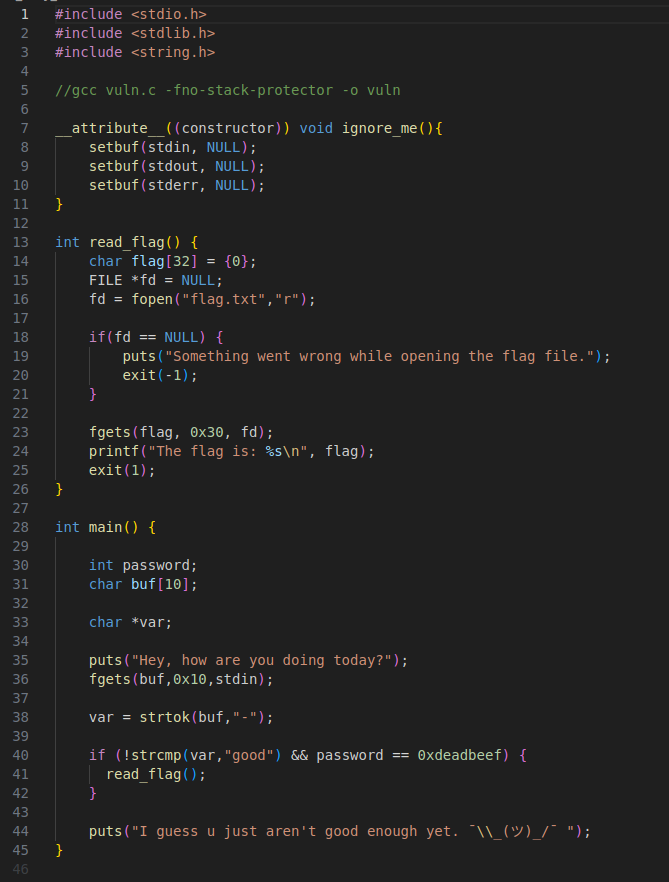
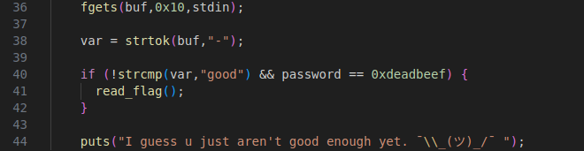
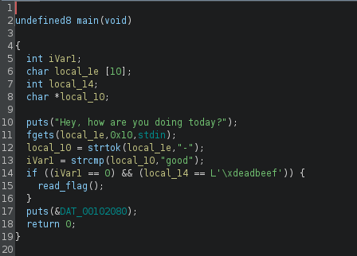
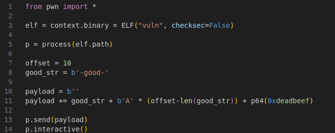
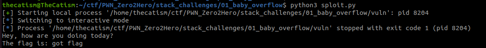

This challenge was found [here](https://github.com/seal9055/PWN_Zero2Hero/tree/main)

* * *

## Vulnerability

The source was provided for this challenge

The vulnerablitiy can be seen on `line 36`. The fgets call is set to read 0x10 bytes (16 in decimal) instead of just 10 bytes which is the size of our buffer. This gives us 6 extra bytes that we can write onto the stack.

## Exploitation

The source file shows that there is an input check that needs to be met before the flag can be read.

If the check isn't met then the program will just print `I guess u just aren't good enough yet. ¯\\_(ツ)_/¯`

To bypass this check we first need to make sure that `-good-` is a part of our input. This ensures that `good` gets tokenized.

After that we need to send `0xdeadbeef` at the end of our input to change the value of password and bypass the second check.

When you open the binary in ghidra you can see that the extra 6 bytes of data we overflow pours in to the password variable that gets checked. This happens because the password variable (local_14) is placed after our buffer (local_1e) on the stack.

We can use pwntools to interact with the program and send our input. 

Our input will look like this `-good-AAAA\xef\xbe\xad\xde`. it starts off by tokenizing good and then sending `4 A's` to fill the rest of the buffer. `0xdeadbeef` is then added at the end to bypass the password check. `0xdeadbeef` is backwards due to the program being little endian.

## Solution

Pwntools solve script is below with the flag

