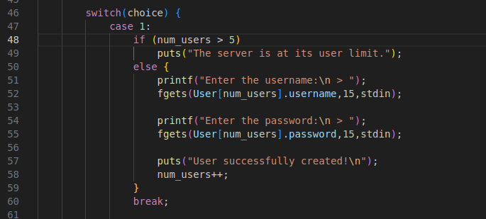
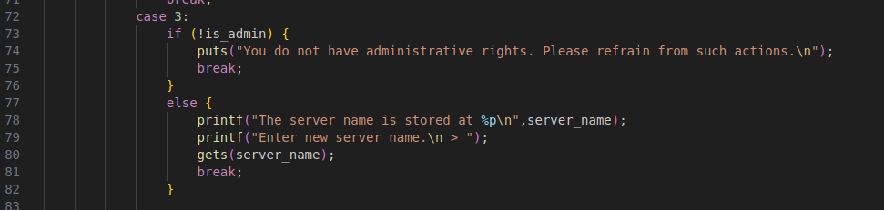
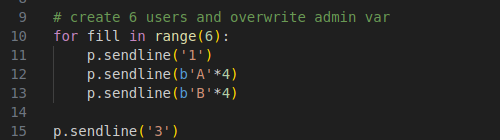
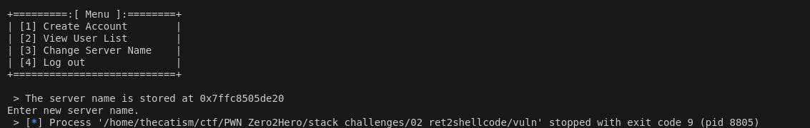
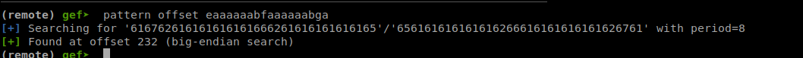
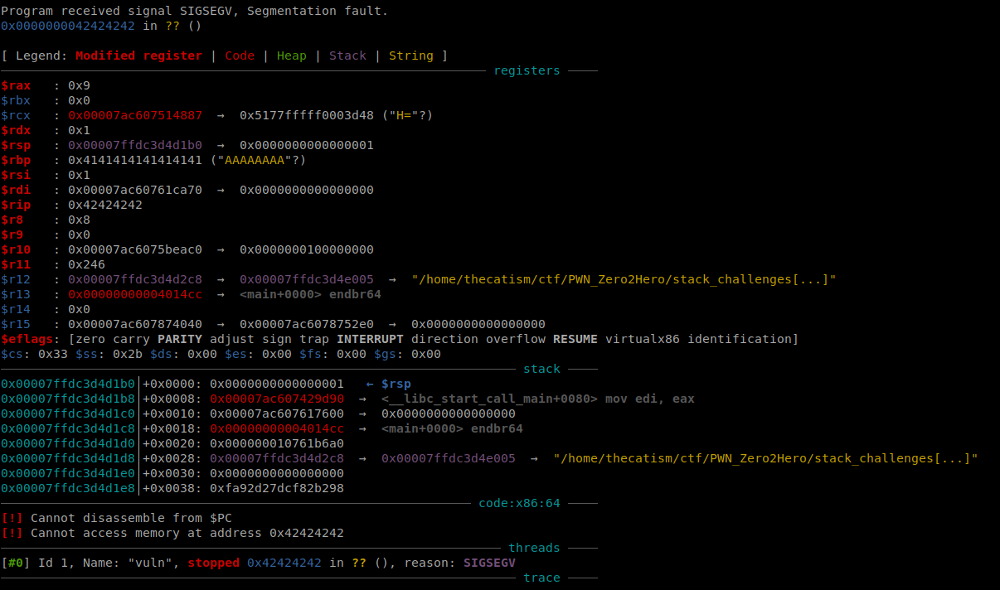
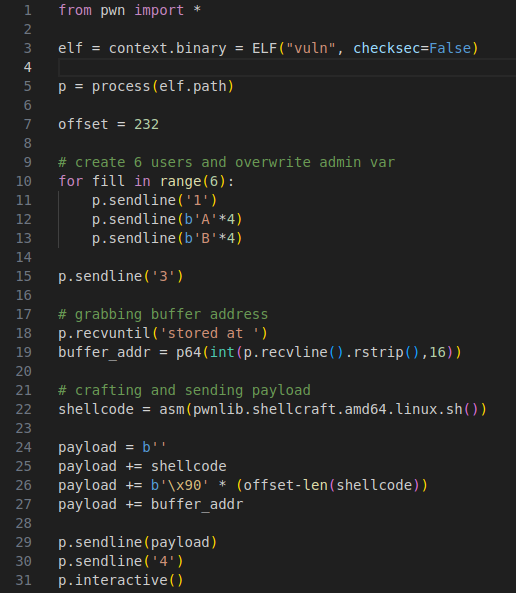
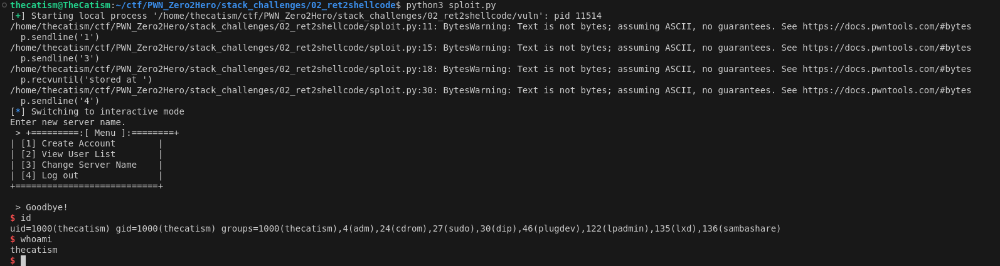

This was challenge 2 from Seal's Pwn Zero2Hero.

* * *

The source for this challenge was provided.

```
#include <stdio.h>
#include <stdlib.h>
#include <string.h>
#include <unistd.h>

//gcc vuln.c -fno-stack-protector -no-pie -z execstack -o vuln

__attribute__((constructor)) void ignore_me(){
    setbuf(stdin, NULL);
    setbuf(stdout, NULL);
    setbuf(stderr, NULL);
}

#define MAX_USERS 5
struct user {
	char username[16];
	char password[16];
};

void server() {

	int choice;
	char buf[0x10];

	struct user User[MAX_USERS];
	int num_users = 0;
	int is_admin = 0;
	char server_name[0x20] = "my_cool_server!";
	
	while(1) {

		puts("+=========:[ Menu ]:========+");
	    puts("| [1] Create Account	    |");
	    puts("| [2] View User List 	    |");
	    puts("| [3] Change Server Name    |");
	    puts("| [4] Log out		    |");
	    puts("+===========================+");
	    printf("\n > ");

		if (fgets(buf, sizeof(buf), stdin) == NULL) {
		    exit(-1);
		}  

		choice = atoi(buf);

		switch(choice) {
		   	case 1:
				if (num_users > 5)
				   	puts("The server is at its user limit.");
				else {
				   	printf("Enter the username:\n > ");
				   	fgets(User[num_users].username,15,stdin);

				   	printf("Enter the password:\n > ");
				   	fgets(User[num_users].password,15,stdin);

				   	puts("User successfully created!\n");
				   	num_users++;
				}
				break;

			case 2:
				if (num_users == 0)
					puts("There are no users on this server yet.\n");

				else {
					for (int i = 0; i < num_users; i++) {
						printf("%d: %s",i+1, User[i].username);
					}
				}
				break;
			case 3:
				if (!is_admin) {
					puts("You do not have administrative rights. Please refrain from such actions.\n");
					break;
				}
				else {
					printf("The server name is stored at %p\n",server_name);
					printf("Enter new server name.\n > ");
					gets(server_name);					
					break;
				}

			case 4:
				puts("Goodbye!");
				return;
		}
   	}
}

void main() {

	puts("Welcome to this awesome server!");
	puts("I hired a professional to make sure its security is top notch.");
	puts("Have fun!\n");

	server();
}
```

The main gist of the code is that it's a program that lets you add in users, change the server name, and view the users

## Vulnerability

The first vulnerabilty is that the create user case (case 1) lets you create 6 users instead of 5 which is more than the max.



The second vulnerability can be found in the change server name case (case 3). It uses the `gets()` function so there's 0 bound checking on our input.
The change server name case also has an `is_admin` check.



This check can be bypassed by creating 6 users.
The 6th user's contents will overflow into the `is_admin` variable allowing us to bypass the check.

## Exploitation

We can use `pwntools` to interact with the program and get to the gets call.



The snippet above lets us reach the server name case and gives us the buffer address.



Now we can try to overwrite the return address.
We can do this by sending a cyclic pattern to the server name case and then selecting option 4 so that we hit the return instruction.
Sending 250 bytes and looking for the pattern that appears at RSP when the segfault occurs leads us to an offset of 232.



We can confirm that the offset is correct by sending `A*232+BBBBBBBB` as the input
This will cause the program to seg fault at 0x42424242 and set RIP to the B's that we sent



Now we can build the payload and get a shell. We need some shelcode, a NOP sled, and the buffer address that was given to us.
I used shellcraft from pwntools to create my shellcode `asm(pwnlib.shellcraft.amd64.linux.sh())`

Final payload that gets sent will look like this. `shellcode + \x90*(offset-len(shellcode)) + buffer address`

## Solution

Running the script will give you a shell and let you get the flag



