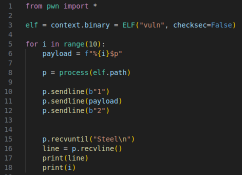
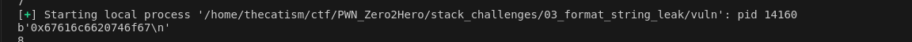
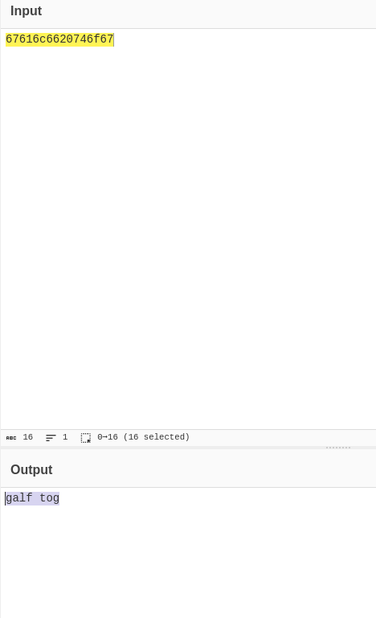

This was challenge 3 from Seal's Pwn Zero2Hero. 

* * *

The source for the challenge was provided.

```
#include <stdio.h>
#include <stdlib.h>
#include <string.h>

//gcc vuln.c -fno-stack-protector -z execstack -no-pie -o vuln

__attribute__((constructor)) void ignore_me(){
    setbuf(stdin, NULL);
    setbuf(stdout, NULL);
    setbuf(stderr, NULL);
}

void main() {

    char building_material[3][10] = { "Wood", "Bricks", "Steel" };

    char flag[0x30] = {0};
    FILE *fd = NULL;
    fd = fopen("flag.txt","r");
    fgets(flag, 0x30, fd);

    int num = 3;
    int choice;
    char buf[0x10];

    puts("Lets build a house!");
    puts("   .-. ________   ");
    puts("   |=|/     /  \\  ");
    puts("   | |_____|_\"\"_| ");
    puts("   |_|_[X]_|____| \n");

    while(1) {
        
        puts("What do you want to do?");
        puts(" [1] Add More material");
        puts(" [2] View Material");
        puts(" [3] Finish House");
        printf("\n > ");
          

        if (fgets(buf, sizeof(buf), stdin) == NULL) {
            exit(-1);
        }  

        choice = atoi(buf);

        switch(choice) {
            case 1:
                if (num >= 10)
                    puts("You have added the max amount of material.");
                else {
                    fgets(building_material[num],sizeof(buf),stdin);
                    num++;
                }
                break;
                  
            case 2:
                printf("\n");
                for(int i = 0; i < num; i++) {
                    printf(building_material[i]);
                    printf("\n");
                }
                printf("\n");
                break;
            case 3:
                puts("It looks like we did not have everything we needed. The build was a failure.");
                exit(-1);
        }
    } 
}
```

## Vulnerability

The vuln for this challenge is a format string bug in case 2 of the switch statement. 
it's printf currently doesn't use a format specifier and looks like this  `printf(building_material[i]);` instead of `printf("%s", building_material[i]);`. This allows an attacker to leak values from the stack that can be used for exploitation purposes.

## Solution

We can make a script that loops 10 times reading whats on the stack at different offsets. We'll use the %p format specifer to read the addresses.



This ends up printing the flag backwards which was stored at offset 8.



