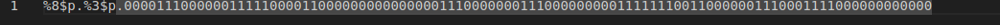
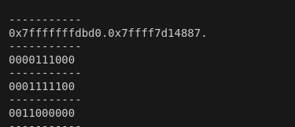
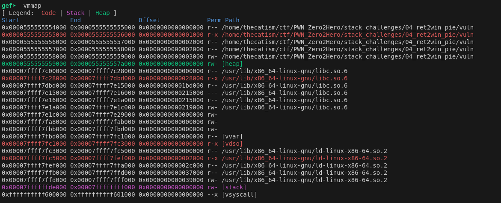
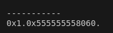
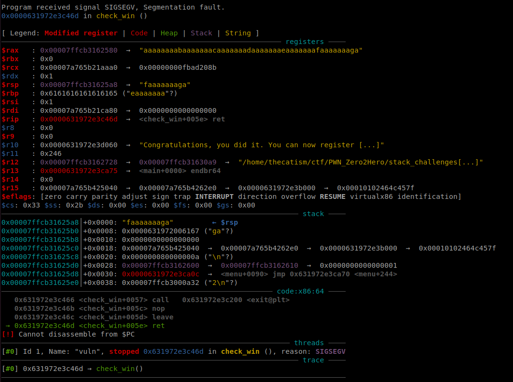
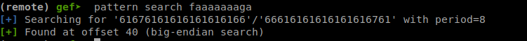
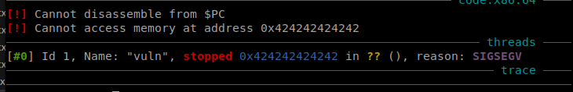
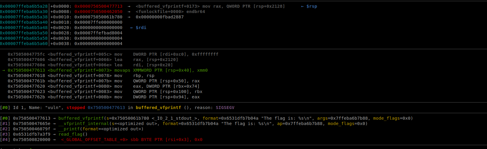
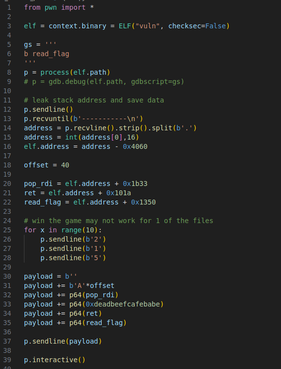
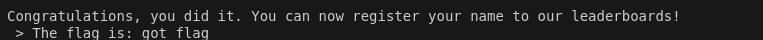

This was the 4th challenge from Seal's Pwn Zero2Hero.  This challenge came with 5 file.txt's and an input.txt

* * *

The source for this challenge was provided.

```
#include <stdio.h>
#include <stdlib.h>
#include <stddef.h>
#include <strings.h>
#include <time.h>
#include <math.h>

//gcc vuln.c -fno-stack-protector -o vuln

__attribute__((constructor)) void ignore_me(){
    setbuf(stdin, NULL);
    setbuf(stdout, NULL);
    setbuf(stderr, NULL);
}

int board[10][10];
char user_board[10][11];
int user_score = 0;
int computer_score = 0;
int ship_count;

void read_flag(long arg1) {
	char flag[32] = {0};
	FILE *fd = NULL;
	fd = fopen("flag.txt","r");

	if(fd == NULL) {
		puts("Something went wrong while opening the flag file.");
		exit(-1);
	}

	if (arg1 == 0xdeadbeefcafebabe) {
		fgets(flag, 0x30, fd);
		printf("The flag is: %s\n", flag);
	}
	fclose(fd);
	exit(1);
}

void check_win() {

	char name[0x20];

	if (user_score == 10) {
		printf("Congratulations, you did it. You can now register your name to our leaderboards!\n > ");
		gets(name);
	}

	else if (computer_score == 10) {
		puts("Unfortuntalely the computer won this game, I hope you still had fun!");
		exit(0);
	}
} 

void init_board() {
	
	srand(0);
	int random_num = (rand() % 5) + 1;
	char file_name[0x10];  
	FILE *fd;

	sprintf(file_name, "file_%d.txt",random_num);

	fd = fopen(file_name,"r");

	for (int i = 0; i < 10; i++) {
		for (int j = 0; j < 10; j++) {
			board[i][j] = fgetc(fd)-48;
		}
	}
	fclose(fd);
}

void print_user_board() {

	char *tmp;

	puts("You can see your board below: ");
	
	for (int i = 0; i < 10; i++) {
			printf("\n-----------\n");
			tmp = user_board[i];
			printf(tmp);
	}
	printf("\n-----------\n\n\n");
}

void print_rules() {

	puts("Below you can find the rules to our exciting Battleship game!\n\n");
	puts("1. The game is played Human vs Computer.");
	puts("2. To achieve victory you need to gain 10 points before the computer does and select the win option in the menu.");
	puts("3. You can get points by attacking fields on the enemy board that contain ships.");
	puts("4. If the computer gets 10 points before you do, you lose.");
	puts("5. You can set up your own board by providing a sequence of 100 characters containing ONLY 0's and 1's. This sequence will determine ur own board.");
	puts("\tThis file has to be named 'input.txt'. An example file is included.");
	printf("\n\n\n");
}

void print_menu() {

	puts("+=========:[ Menu ]:=========+");	    
	puts("| [1] Print Rules  	     |");
 	puts("| [2] Play a round 	     |");
 	puts("| [3] Print Scores 	     |");
	puts("| [4] Print user Board       |");
	puts("| [5] Give up 		     |");
	puts("+============================+");
	printf("\n > ");	
}

void get_user_board() {

	FILE *fd;
	char *tmp;

	fd = fopen("input.txt","r");

	for (int i = 0; i < 10; i++) {
		for (int j = 0; j < 10; j++) {
			user_board[i][j] = fgetc(fd);
			if (user_board[i][j] == 49)
				ship_count++;
		}
		user_board[i][10] = '\x0';
	}

	printf("You provided %d ships.\n",ship_count);

	print_user_board();

	if (ship_count < 25) {
		puts("Please provide at least 25 ships so the computer has a chance.");
		exit(-1);
	}
	fclose(fd);
}

void play_round() {

	int x,y;
	char buf[0x10];

	puts("What field do you wish to attack? (x axis)");
	x = atoi(fgets(buf,sizeof(buf),stdin));

	puts("What field do you wish to attack? (y axis)");
	y = atoi(fgets(buf,sizeof(buf),stdin));

	if (board[x][y] == 1) {		
		puts("Congrats, you got a hit!\n");
		user_score++;
	}

	srand(time(NULL));
	x = (rand() % 10) + 1;
	y = (rand() % 10) + 1;

	if (user_board[x][y] == 49) {
		puts("Oh no, the computer hit one of your ships!\n");
		computer_score++;
	}
	check_win();
}

void menu() {

	char buf[0x10];
	int choice;
	
	while(1) {
		
		print_menu();

		if (fgets(buf, sizeof(buf), stdin) == NULL) {
		    exit(-1);
		}

		choice = atoi(buf);

		switch(choice) {
		   	case 1:
				print_rules();
				break;
			case 2:
				play_round();
				break;
			case 3:
				printf("User Score: %d\n", user_score);
				printf("Computer Score: %d\n\n", computer_score);
				break;
			case 4:
				print_user_board();
				break;
			case 5:
				puts("Thanks for playing!");
				exit(0);
			default:
				puts("Invalid input");

		}
	}
}

void main() {

	puts("Lets play a game of Battleships!\n");

	init_board();
	print_rules();

	puts("When you are ready to continue, press enter");
	getchar();

	get_user_board();

	menu();
}

```

Gist is that the program is a game that take's user input from the shell and from input.txt. You need 10 points to wiin the game

## Vulnerability

The rules of the game specifies that it only wants 0's or 1's but there isn't a check to prevent a user from entering other characters.
There's a format string error in the `print_user_board` function since it uses printf without a specifer.
The check win function uses `gets()`.

With these vulns we can leak addresses by modifying the input.txt file with %p
We can reach the gets call by hitting the computers ship 10x and entering a name thats more than 0x20. This lead to a seg fault.

We will also use the leak to bypass the PIE mitigation and then jump to where the flag is printed.

## Exploitation

Using vmmap in GDB shows that the addresses leaked at the 3rd and 8th offsets are from the stack and libc.







This won't help us bypass PIE though so instead we'll use the second offset which is within the code section.
To get the base of the elf  for our script, we need to substract the leaked pointer from the first address on vmmap (base_address 0x0000555555554000 in the image) this gives us an offset of 0x4060. 



For the actual game interaction of our script you abuse the fact that nothing stops you from using the same input multiple times even after a hit. So wecan use that to speed through the game.

The `read_flag` function has an agrument check that we can bypass by using a pop rdi gadget. We can find one using ROPGadget.


We can call GDB from within our pwntools script to get the offset needed to overwrite the return address.



We know from the source that the buffer limit for name is 0x20 so the offset shouldn't be too far from that.



GDB shows the offset as 40. Now to test if we can control the instruction pointer.



Now that we control the instruction pointer we can use the pop rdi gadget and pass the `0xdeadbeefcafebabe` argument and get the flag.
We run into this issue though which just means that our stack is misaligned. The stack needs to be 16 bytes aligned for x64. We can solve this by adding a ret gadget to our rop chain. We need to put it inbetween the passed arg and the function call. Essentially this ret will act as padding.



## Solution

After that running our solve script as well as adding `%2$p.` to the start of input.txt gives the flag.



