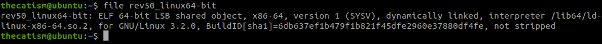
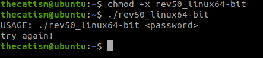
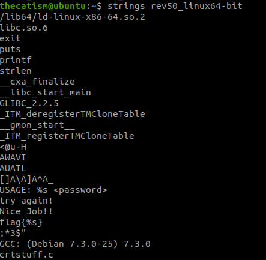
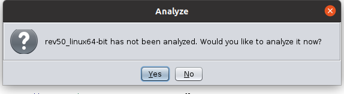
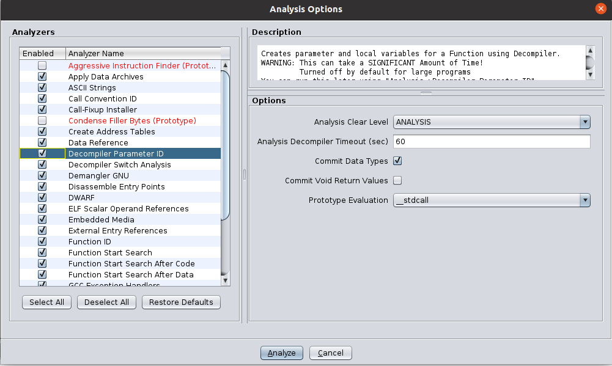
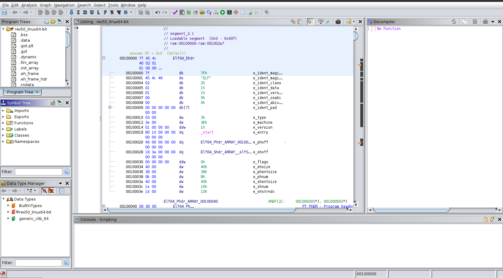
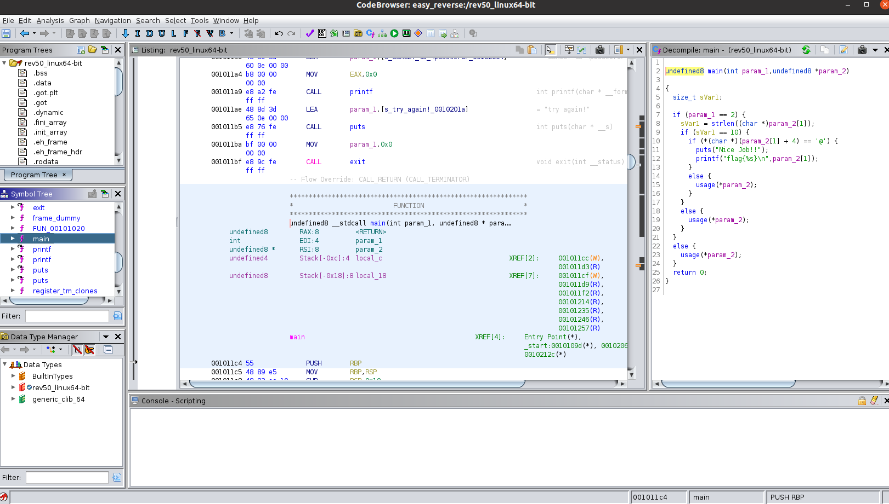
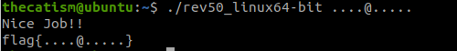
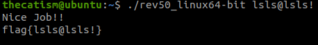
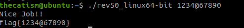

Easy_Reverse is a crackme challenge from [crackmes.one](https://crackmes.one/crackme/5b8a37a433c5d45fc286ad83)

This binary is geared towards beginners and allows you to get your feet wet with reverse engineering.

Crackmes.one is a platform where you can find many different reverse engineering challenge and improve your RE skills

The main goal for the Easy_Reverse challenge is to find the correct password and to get the flag.

# Tools Used

### Ghidra

[Ghidra](https://ghidra-sre.org/) is a reverse engineering tool that was developed by the NSA. The tool allows you to disassemble and decompile binaries, as well as other RE operations.

# Analyzing the Binary

After downloading and extracting the file from crackmes.one we are given a file named rev50_linux64-bit. 

Since we don't know much about the file type and the architecture we can use the **file** command. This Linux command is used to tell you the type of a file. To learn more about this command you can run **man file** in a terminal.



Running the **file** command tells us that executable is a 64-bit ELF file that runs on the x86-64 processor.

Now that we know a little more about the file we can run it to see what it does and to see if it was expecting any command line arguments.



After running the file you can see that it takes a password as a command line argument.

By running **strings** on the binary we see that the executable expects a correct password. If it gets the correct password it will give you a flag, otherwise it will tell you to try again.

We also can use **strings** to see if there were any hard-coded flags or passwords.

The **strings** command is a Linux command that allows you to display text strings that are contained in a binary.



## Decompiling

Now that we understand what the executable is doing a little better, let's use Ghidra to decompile the file. Decompiling is the process translating the assembly code contained in a compiled file back into human readable code.

If you haven't installed Ghidra before, these links can help you get started.

```
https://ghidra-sre.org/InstallationGuide.html
https://www.youtube.com/watch?v=OJlKtRgC68U
```

After importing the file you can use Ghidra to analyze it.



For the analyzers I used all of the default options. I also selected the **Decompiler Parameter ID** option. This option lets Ghidra create parameters and local variables for a function when it is decompiling. This can help us understand the executable better after Ghidra finishes decompiling.



After selecting analyze we see this on our screen.



The middle window pane contains the disassembled version of the file. This window is also called the Listing window. Pretty much this is where we will see assembly code for this binary.

The right window pane is where we will see the decompiled output.

On the left side of the screen there's a section called Symbol Tree which has a subsection called Functions. The Function subsection contains all of the functions that are referenced by this binary. When you select the drop down arrow on Functions you will want to look for the main function. The main function is the first function that called when a program is executed.

## Analyzing the Main Function

When we select the main function we can see the function decompiled into something that is easier to read. While analyzing the main function we can see that when we supply a password it checks the length of the password to see if the length is equal to ten. If the length of the inputted password is not 10 the program will display usage menu. If the length is 10 the program checks if the 5th character (when counting from 1) in the password is an @. If the 5th character is an @ symbol the program will display the flag, otherwise it will display the usage menu.



## Getting the Flag

Since we now know what the program is looking for when a user inputs a password, we can now get the flag.

By making a 10 character long password and making the 5th character an @ symbol we now receive this message when running the file.



Since the program is only checking the 5th character of the password and its length there's many different password combinations that we can use to display the nice job message.

  


As long as the length of the password is 10 and the 5th character is an @ symbol the program will accept any password that we give it.